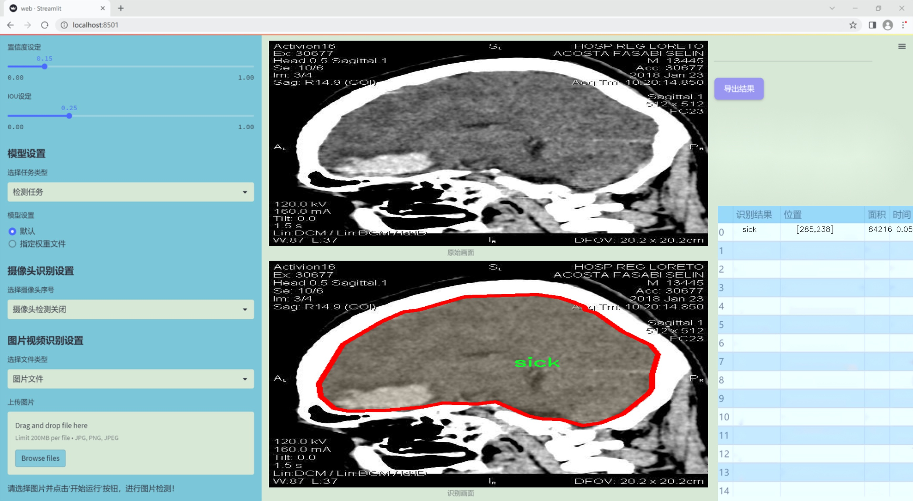
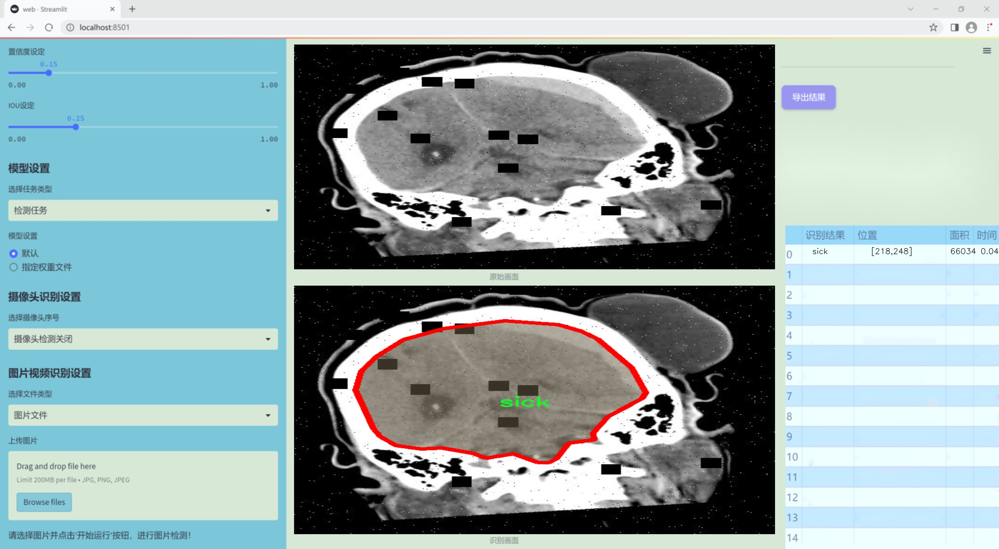
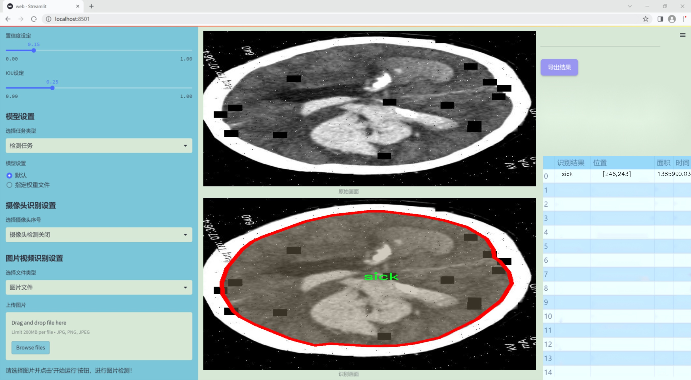
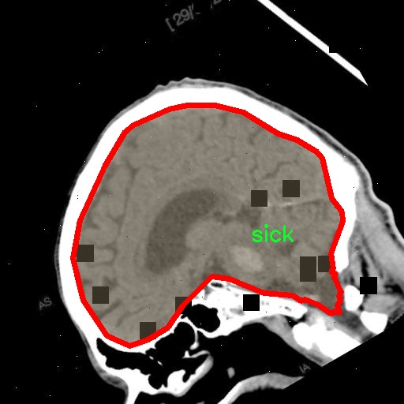
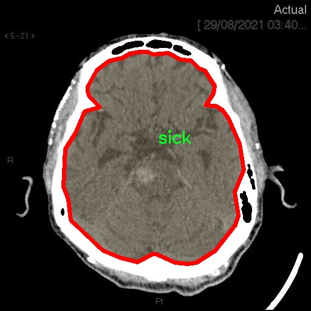
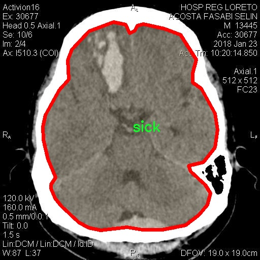
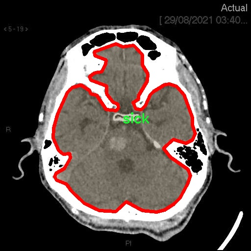
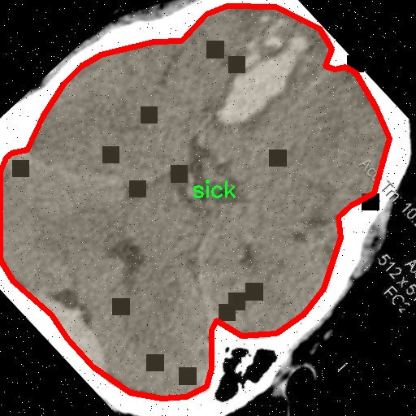

### 1.背景意义

### 研究背景与意义

随着现代医学影像技术的快速发展，脑部健康状态的检测与评估已成为神经科学和临床医学研究中的重要课题。脑部疾病的早期发现和及时干预对患者的康复至关重要。然而，传统的脑部健康评估方法往往依赖于专业医师的经验和判断，容易受到主观因素的影响，且在处理大量影像数据时效率较低。因此，基于计算机视觉的自动化检测系统应运而生，能够为脑部健康状态的评估提供更加客观和高效的解决方案。

本研究旨在基于改进的YOLOv11模型，构建一个高效的脑部健康状态检测系统。该系统利用深度学习技术，能够自动识别和分类脑部影像中的健康与病变状态。通过使用包含1800幅图像的hsbrain数据集，该数据集涵盖了“健康”和“病变”两种类别，为模型的训练和评估提供了丰富的样本基础。数据集的多样性和丰富性使得模型能够更好地学习到不同脑部状态的特征，从而提高检测的准确性和鲁棒性。

此外，随着人工智能技术的不断进步，YOLO系列模型在目标检测领域表现出色，具备实时性和高效性的优势。通过对YOLOv11的改进，结合数据集中的图像预处理和增强技术，本研究期望能够提升模型在脑部健康状态检测中的表现。这不仅有助于推动脑部疾病的早期筛查和诊断，还能为临床医生提供有力的辅助工具，降低误诊率，提高患者的治疗效果。

综上所述，基于改进YOLOv11的脑部健康状态检测系统的研究，不仅具有重要的学术价值，还有助于推动医学影像分析技术的发展，为脑部疾病的早期发现和干预提供新的思路和方法。

### 2.视频效果

[2.1 视频效果](https://www.bilibili.com/video/BV19ykLYjErH/)

### 3.图片效果







##### [项目涉及的源码数据来源链接](https://kdocs.cn/l/cszuIiCKVNis)**

注意：本项目提供训练的数据集和训练教程,由于版本持续更新,暂不提供权重文件（best.pt）,请按照6.训练教程进行训练后实现上图演示的效果。

### 4.数据集信息

##### 4.1 本项目数据集类别数＆类别名

nc: 2
names: ['healthy', 'sick']


该项目为【图像分割】数据集，请在【训练教程和Web端加载模型教程（第三步）】这一步的时候按照【图像分割】部分的教程来训练

##### 4.2 本项目数据集信息介绍

本项目数据集信息介绍

本项目所使用的数据集名为“hsbrain”，旨在为改进YOLOv11的脑部健康状态检测系统提供强有力的支持。该数据集专注于脑部健康状态的分类，涵盖了两种主要类别：健康（healthy）和疾病（sick）。通过对这两类数据的深入分析与训练，我们希望能够提高系统在脑部健康状态检测中的准确性和鲁棒性。

数据集中的样本来源广泛，涵盖了不同年龄段、性别和种族的个体，确保了数据的多样性和代表性。每个样本均经过专业医学人员的标注，确保了健康与疾病状态的准确分类。数据集中的图像不仅包括常规的脑部扫描图像，还涵盖了不同病理状态下的脑部影像，以便于系统学习到更为复杂的特征和模式。这种多样化的样本选择使得模型在实际应用中能够更好地适应不同的临床场景。

在数据预处理阶段，我们对图像进行了标准化处理，以消除不同成像设备和技术带来的影响。同时，为了增强模型的泛化能力，我们还应用了数据增强技术，包括旋转、缩放和翻转等操作，以增加训练样本的多样性。这些措施不仅提高了模型的训练效果，也为其在真实世界应用中的表现奠定了坚实的基础。

总之，hsbrain数据集为本项目提供了丰富的训练素材，通过对健康与疾病状态的有效分类，我们期望在脑部健康状态检测领域取得显著的进展。这一数据集的构建与应用，将为未来的脑部疾病早期诊断和干预提供重要的技术支持。











### 5.全套项目环境部署视频教程（零基础手把手教学）

[5.1 所需软件PyCharm和Anaconda安装教程（第一步）](https://www.bilibili.com/video/BV1BoC1YCEKi/?spm_id_from=333.999.0.0&vd_source=bc9aec86d164b67a7004b996143742dc)


[5.2 安装Python虚拟环境创建和依赖库安装视频教程（第二步）](https://www.bilibili.com/video/BV1ZoC1YCEBw?spm_id_from=333.788.videopod.sections&vd_source=bc9aec86d164b67a7004b996143742dc)

### 6.改进YOLOv11训练教程和Web_UI前端加载模型教程（零基础手把手教学）

[6.1 改进YOLOv11训练教程和Web_UI前端加载模型教程（第三步）](https://www.bilibili.com/video/BV1BoC1YCEhR?spm_id_from=333.788.videopod.sections&vd_source=bc9aec86d164b67a7004b996143742dc)


按照上面的训练视频教程链接加载项目提供的数据集，运行train.py即可开始训练



     Epoch   gpu_mem       box       obj       cls    labels  img_size
     1/200     20.8G   0.01576   0.01955  0.007536        22      1280: 100%|██████████| 849/849 [14:42<00:00,  1.04s/it]
               Class     Images     Labels          P          R     mAP@.5 mAP@.5:.95: 100%|██████████| 213/213 [01:14<00:00,  2.87it/s]
                 all       3395      17314      0.994      0.957      0.0957      0.0843

     Epoch   gpu_mem       box       obj       cls    labels  img_size
     2/200     20.8G   0.01578   0.01923  0.007006        22      1280: 100%|██████████| 849/849 [14:44<00:00,  1.04s/it]
               Class     Images     Labels          P          R     mAP@.5 mAP@.5:.95: 100%|██████████| 213/213 [01:12<00:00,  2.95it/s]
                 all       3395      17314      0.996      0.956      0.0957      0.0845

     Epoch   gpu_mem       box       obj       cls    labels  img_size
     3/200     20.8G   0.01561    0.0191  0.006895        27      1280: 100%|██████████| 849/849 [10:56<00:00,  1.29it/s]
               Class     Images     Labels          P          R     mAP@.5 mAP@.5:.95: 100%|███████   | 187/213 [00:52<00:00,  4.04it/s]
                 all       3395      17314      0.996      0.957      0.0957      0.0845


###### [项目数据集下载链接](https://kdocs.cn/l/cszuIiCKVNis)

### 7.原始YOLOv11算法讲解


##### YOLO11介绍

Ultralytics YOLO11是一款尖端的、最先进的模型，它在之前YOLO版本成功的基础上进行了构建，并引入了新功能和改进，以进一步提升性能和灵活性。
**YOLO11设计快速、准确且易于使用，使其成为各种物体检测和跟踪、实例分割、图像分类以及姿态估计任务的绝佳选择。**


**结构图如下：**


##### **C3k2**

**C3k2，结构图如下**


**C3k2，继承自类`C2f，其中通过c3k设置False或者Ture来决定选择使用C3k还是`**Bottleneck


**实现代码** **ultralytics/nn/modules/block.py**

##### C2PSA介绍

**借鉴V10 PSA结构，实现了C2PSA和C2fPSA，最终选择了基于C2的C2PSA（可能涨点更好？）**


**实现代码** **ultralytics/nn/modules/block.py**

##### Detect介绍

**分类检测头引入了DWConv（更加轻量级，为后续二次创新提供了改进点），结构图如下（和V8的区别）：**


### 8.200+种全套改进YOLOV11创新点原理讲解

#### 8.1 200+种全套改进YOLOV11创新点原理讲解大全

由于篇幅限制，每个创新点的具体原理讲解就不全部展开，具体见下列网址中的改进模块对应项目的技术原理博客网址【Blog】（创新点均为模块化搭建，原理适配YOLOv5~YOLOv11等各种版本）

[改进模块技术原理博客【Blog】网址链接](https://gitee.com/qunmasj/good)


#### 8.2 精选部分改进YOLOV11创新点原理讲解

###### 这里节选部分改进创新点展开原理讲解(完整的改进原理见上图和[改进模块技术原理博客链接](https://gitee.com/qunmasj/good)【如果此小节的图加载失败可以通过CSDN或者Github搜索该博客的标题访问原始博客，原始博客图片显示正常】

### 动态蛇形卷积Dynamic Snake Convolution

参考论文： 2307.08388.pdf (arxiv.org)

血管、道路等拓扑管状结构的精确分割在各个领域都至关重要，确保下游任务的准确性和效率。 然而，许多因素使任务变得复杂，包括薄的局部结构和可变的全局形态。在这项工作中，我们注意到管状结构的特殊性，并利用这些知识来指导我们的 DSCNet 在三个阶段同时增强感知：特征提取、特征融合、 和损失约束。 首先，我们提出了一种动态蛇卷积，通过自适应地关注细长和曲折的局部结构来准确捕获管状结构的特征。 随后，我们提出了一种多视图特征融合策略，以补充特征融合过程中多角度对特征的关注，确保保留来自不同全局形态的重要信息。 最后，提出了一种基于持久同源性的连续性约束损失函数，以更好地约束分割的拓扑连续性。 2D 和 3D 数据集上的实验表明，与多种方法相比，我们的 DSCNet 在管状结构分割任务上提供了更好的准确性和连续性。 我们的代码是公开的。 
主要的挑战源于细长微弱的局部结构特征与复杂多变的全局形态特征。本文关注到管状结构细长连续的特点，并利用这一信息在神经网络以下三个阶段同时增强感知：特征提取、特征融合和损失约束。分别设计了动态蛇形卷积（Dynamic Snake Convolution），多视角特征融合策略与连续性拓扑约束损失。 

我们希望卷积核一方面能够自由地贴合结构学习特征，另一方面能够在约束条件下不偏离目标结构太远。在观察管状结构的细长连续的特征后，脑海里想到了一个动物——蛇。我们希望卷积核能够像蛇一样动态地扭动，来贴合目标的结构。

我们希望卷积核一方面能够自由地贴合结构学习特征，另一方面能够在约束条件下不偏离目标结构太远。在观察管状结构的细长连续的特征后，脑海里想到了一个动物——蛇。我们希望卷积核能够像蛇一样动态地扭动，来贴合目标的结构。


### DCNV2融入YOLOv11
DCN和DCNv2（可变性卷积）
网上关于两篇文章的详细描述已经很多了，我这里具体的细节就不多讲了，只说一下其中实现起来比较困惑的点。（黑体字会讲解）

DCNv1解决的问题就是我们常规的图像增强，仿射变换（线性变换加平移）不能解决的多种形式目标变换的几何变换的问题。如下图所示。

可变性卷积的思想很简单，就是讲原来固定形状的卷积核变成可变的。如下图所示：


首先来看普通卷积，以3x3卷积为例对于每个输出y(p0)，都要从x上采样9个位置，这9个位置都在中心位置x(p0)向四周扩散得到的gird形状上，(-1,-1)代表x(p0)的左上角，(1,1)代表x(p0)的右下角，其他类似。

用公式表示如下：


可变性卷积Deformable Conv操作并没有改变卷积的计算操作，而是在卷积操作的作用区域上，加入了一个可学习的参数∆pn。同样对于每个输出y(p0)，都要从x上采样9个位置，这9个位置是中心位置x(p0)向四周扩散得到的，但是多了 ∆pn，允许采样点扩散成非gird形状。


偏移量是通过对原始特征层进行卷积得到的。比如输入特征层是w×h×c，先对输入的特征层进行卷积操作，得到w×h×2c的offset field。这里的w和h和原始特征层的w和h是一致的，offset field里面的值是输入特征层对应位置的偏移量，偏移量有x和y两个方向，所以offset field的channel数是2c。offset field里的偏移量是卷积得到的，可能是浮点数，所以接下来需要通过双向性插值计算偏移位置的特征值。在偏移量的学习中，梯度是通过双线性插值来进行反向传播的。
看到这里是不是还是有点迷茫呢？那到底程序上面怎么实现呢？


事实上由上面的公式我们可以看得出来∆pn这个偏移量是加在原像素点上的，但是我们怎么样从代码上对原像素点加这个量呢？其实很简单，就是用一个普通的卷积核去跟输入图片（一般是输入的feature_map）卷积就可以了卷积核的数量是2N也就是23*3==18（前9个通道是x方向的偏移量，后9个是y方向的偏移量），然后把这个卷积的结果与正常卷积的结果进行相加就可以了。
然后又有了第二个问题，怎么样反向传播呢？为什么会有这个问题呢？因为求出来的偏移量+正常卷积输出的结果往往是一个浮点数，浮点数是无法对应到原图的像素点的，所以自然就想到了双线性差值的方法求出浮点数对应的浮点像素点。


#### DCN v2
对于positive的样本来说，采样的特征应该focus在RoI内，如果特征中包含了过多超出RoI的内容，那么结果会受到影响和干扰。而negative样本则恰恰相反，引入一些超出RoI的特征有助于帮助网络判别这个区域是背景区域。

DCNv1引入了可变形卷积，能更好的适应目标的几何变换。但是v1可视化结果显示其感受野对应位置超出了目标范围，导致特征不受图像内容影响（理想情况是所有的对应位置分布在目标范围以内）。

为了解决该问题：提出v2, 主要有

1、扩展可变形卷积，增强建模能力
2、提出了特征模拟方案指导网络培训：feature mimicking scheme

上面这段话是什么意思呢，通俗来讲就是，我们的可变性卷积的区域大于目标所在区域，所以这时候就会对非目标区域进行错误识别。

所以自然能想到的解决方案就是加入权重项进行惩罚。（至于这个实现起来就比较简单了，直接初始化一个权重然后乘(input+offsets)就可以了）


可调节的RoIpooling也是类似的，公式如下：


### 9.系统功能展示

图9.1.系统支持检测结果表格显示

  图9.2.系统支持置信度和IOU阈值手动调节

  图9.3.系统支持自定义加载权重文件best.pt(需要你通过步骤5中训练获得)

  图9.4.系统支持摄像头实时识别

  图9.5.系统支持图片识别

  图9.6.系统支持视频识别

  图9.7.系统支持识别结果文件自动保存

  图9.8.系统支持Excel导出检测结果数据


### 10. YOLOv11核心改进源码讲解

#### 10.1 VanillaNet.py

以下是对给定代码的核心部分进行提炼和详细注释的结果。主要保留了模型的结构和前向传播逻辑。

```python
import torch
import torch.nn as nn
import torch.nn.functional as F
from timm.layers import weight_init

# 定义激活函数类
class Activation(nn.ReLU):
    def __init__(self, dim, act_num=3, deploy=False):
        super(Activation, self).__init__()
        self.deploy = deploy
        # 初始化权重参数
        self.weight = torch.nn.Parameter(torch.randn(dim, 1, act_num * 2 + 1, act_num * 2 + 1))
        self.bias = None
        self.bn = nn.BatchNorm2d(dim, eps=1e-6)  # 批归一化
        self.dim = dim
        self.act_num = act_num
        weight_init.trunc_normal_(self.weight, std=.02)  # 权重初始化

    def forward(self, x):
        # 前向传播
        if self.deploy:
            return F.conv2d(
                super(Activation, self).forward(x), 
                self.weight, self.bias, padding=(self.act_num * 2 + 1) // 2, groups=self.dim)
        else:
            return self.bn(F.conv2d(
                super(Activation, self).forward(x),
                self.weight, padding=self.act_num, groups=self.dim))

    def switch_to_deploy(self):
        # 将模型切换到推理模式
        if not self.deploy:
            kernel, bias = self._fuse_bn_tensor(self.weight, self.bn)
            self.weight.data = kernel
            self.bias = torch.nn.Parameter(torch.zeros(self.dim))
            self.bias.data = bias
            self.__delattr__('bn')  # 删除bn属性
            self.deploy = True

# 定义基本块
class Block(nn.Module):
    def __init__(self, dim, dim_out, act_num=3, stride=2, deploy=False):
        super().__init__()
        self.deploy = deploy
        # 根据是否部署选择不同的卷积结构
        if self.deploy:
            self.conv = nn.Conv2d(dim, dim_out, kernel_size=1)
        else:
            self.conv1 = nn.Sequential(
                nn.Conv2d(dim, dim, kernel_size=1),
                nn.BatchNorm2d(dim, eps=1e-6),
            )
            self.conv2 = nn.Sequential(
                nn.Conv2d(dim, dim_out, kernel_size=1),
                nn.BatchNorm2d(dim_out, eps=1e-6)
            )
        self.pool = nn.MaxPool2d(stride) if stride != 1 else nn.Identity()  # 池化层
        self.act = Activation(dim_out, act_num)  # 激活函数

    def forward(self, x):
        # 前向传播
        if self.deploy:
            x = self.conv(x)
        else:
            x = self.conv1(x)
            x = F.leaky_relu(x, negative_slope=0.1)  # 使用Leaky ReLU激活
            x = self.conv2(x)

        x = self.pool(x)  # 池化
        x = self.act(x)  # 激活
        return x

# 定义VanillaNet模型
class VanillaNet(nn.Module):
    def __init__(self, in_chans=3, num_classes=1000, dims=[96, 192, 384, 768], 
                 drop_rate=0, act_num=3, strides=[2, 2, 2, 1], deploy=False):
        super().__init__()
        self.deploy = deploy
        # 构建网络的stem部分
        if self.deploy:
            self.stem = nn.Sequential(
                nn.Conv2d(in_chans, dims[0], kernel_size=4, stride=4),
                Activation(dims[0], act_num)
            )
        else:
            self.stem1 = nn.Sequential(
                nn.Conv2d(in_chans, dims[0], kernel_size=4, stride=4),
                nn.BatchNorm2d(dims[0], eps=1e-6),
            )
            self.stem2 = nn.Sequential(
                nn.Conv2d(dims[0], dims[0], kernel_size=1, stride=1),
                nn.BatchNorm2d(dims[0], eps=1e-6),
                Activation(dims[0], act_num)
            )

        self.stages = nn.ModuleList()
        for i in range(len(strides)):
            stage = Block(dim=dims[i], dim_out=dims[i + 1], act_num=act_num, stride=strides[i], deploy=deploy)
            self.stages.append(stage)  # 添加每个Block到模型中

    def forward(self, x):
        # 前向传播
        if self.deploy:
            x = self.stem(x)
        else:
            x = self.stem1(x)
            x = F.leaky_relu(x, negative_slope=0.1)
            x = self.stem2(x)

        for stage in self.stages:
            x = stage(x)  # 依次通过每个Block
        return x

# 模型构建函数
def vanillanet_10(pretrained='', **kwargs):
    model = VanillaNet(dims=[128 * 4, 128 * 4, 256 * 4, 512 * 4, 512 * 4, 512 * 4, 512 * 4, 1024 * 4], strides=[1, 2, 2, 1, 1, 1, 2, 1], **kwargs)
    if pretrained:
        weights = torch.load(pretrained)['model_ema']
        model.load_state_dict(weights)  # 加载预训练权重
    return model

if __name__ == '__main__':
    inputs = torch.randn((1, 3, 640, 640))  # 输入数据
    model = vanillanet_10()  # 实例化模型
    pred = model(inputs)  # 前向传播
    for i in pred:
        print(i.size())  # 输出每层的尺寸
```

### 代码说明
1. **Activation 类**: 这是一个自定义的激活函数类，继承自 `nn.ReLU`，增加了可学习的权重和偏置，并支持批归一化。
2. **Block 类**: 这是模型的基本构建块，包含卷积层、池化层和激活函数。根据部署模式选择不同的结构。
3. **VanillaNet 类**: 这是整个网络的主体，包含多个 `Block`，并定义了输入和输出的处理逻辑。
4. **vanillanet_10 函数**: 这是一个模型构建函数，允许用户通过参数指定模型的结构，并支持加载预训练权重。

通过这种方式，代码的核心逻辑得以保留，同时提供了详细的中文注释以帮助理解。

这个程序文件 `VanillaNet.py` 实现了一个名为 VanillaNet 的深度学习模型，主要用于图像处理任务。该模型基于 PyTorch 框架构建，包含多个模块和功能，具体如下：

首先，文件开头包含版权声明和许可证信息，表明该程序是开源的，可以在 MIT 许可证下进行修改和分发。

接下来，程序导入了必要的库，包括 PyTorch 的核心库、神经网络模块、功能模块，以及一些其他工具库如 `numpy`。然后，定义了一个名为 `activation` 的类，继承自 `nn.ReLU`，用于实现自定义的激活函数。该类的构造函数中初始化了一些参数，包括权重和偏置，并使用了批量归一化。`forward` 方法定义了前向传播的过程，具体取决于是否处于部署模式。

`Block` 类是 VanillaNet 的基本构建块，包含了卷积层、池化层和激活函数。根据是否处于部署模式，`Block` 的构造函数会初始化不同的卷积层和批量归一化层。`forward` 方法实现了数据的前向传播，并在每个阶段应用池化和激活函数。

`VanillaNet` 类是整个模型的核心，包含了多个 `Block` 组成的阶段。模型的构造函数接受输入通道数、类别数、维度、丢弃率、激活函数数量、步幅等参数，并根据这些参数构建模型的不同层。模型的前向传播方法 `forward` 处理输入数据，并在不同的尺度上提取特征。

此外，文件中还定义了一些辅助函数，如 `update_weight` 用于更新模型的权重，确保加载的权重与模型的结构相匹配。接下来，定义了一系列函数（如 `vanillanet_5` 到 `vanillanet_13_x1_5_ada_pool`），这些函数用于创建不同配置的 VanillaNet 模型，并可选择加载预训练权重。

最后，在文件的主程序部分，创建了一个随机输入并实例化了 `vanillanet_10` 模型，随后进行前向传播并打印输出特征的尺寸。

整体来看，这个文件实现了一个灵活且可扩展的深度学习模型，适用于各种图像处理任务，并且提供了多种模型配置和预训练权重加载的功能。

#### 10.2 dynamic_snake_conv.py

以下是经过简化并添加详细中文注释的核心代码部分：

```python
import torch
import torch.nn as nn

class DySnakeConv(nn.Module):
    def __init__(self, inc, ouc, k=3) -> None:
        """
        动态蛇形卷积层的初始化
        :param inc: 输入通道数
        :param ouc: 输出通道数
        :param k: 卷积核大小，默认为3
        """
        super().__init__()
        
        # 定义三个卷积层
        self.conv_0 = Conv(inc, ouc, k)  # 标准卷积
        self.conv_x = DSConv(inc, ouc, 0, k)  # 沿x轴的动态蛇形卷积
        self.conv_y = DSConv(inc, ouc, 1, k)  # 沿y轴的动态蛇形卷积
    
    def forward(self, x):
        """
        前向传播函数
        :param x: 输入特征图
        :return: 拼接后的输出特征图
        """
        # 将三个卷积的输出在通道维度上拼接
        return torch.cat([self.conv_0(x), self.conv_x(x), self.conv_y(x)], dim=1)

class DSConv(nn.Module):
    def __init__(self, in_ch, out_ch, morph, kernel_size=3, if_offset=True, extend_scope=1):
        """
        动态蛇形卷积的初始化
        :param in_ch: 输入通道数
        :param out_ch: 输出通道数
        :param morph: 卷积核的形态（0: x轴，1: y轴）
        :param kernel_size: 卷积核大小
        :param if_offset: 是否需要偏移变形
        :param extend_scope: 扩展范围，默认为1
        """
        super(DSConv, self).__init__()
        # 用于学习可变形偏移的卷积层
        self.offset_conv = nn.Conv2d(in_ch, 2 * kernel_size, 3, padding=1)
        self.bn = nn.BatchNorm2d(2 * kernel_size)  # 批归一化
        self.kernel_size = kernel_size

        # 定义沿x轴和y轴的动态蛇形卷积
        self.dsc_conv_x = nn.Conv2d(in_ch, out_ch, kernel_size=(kernel_size, 1), stride=(kernel_size, 1), padding=0)
        self.dsc_conv_y = nn.Conv2d(in_ch, out_ch, kernel_size=(1, kernel_size), stride=(1, kernel_size), padding=0)

        self.gn = nn.GroupNorm(out_ch // 4, out_ch)  # 组归一化
        self.act = Conv.default_act  # 默认激活函数

        self.extend_scope = extend_scope
        self.morph = morph
        self.if_offset = if_offset

    def forward(self, f):
        """
        前向传播函数
        :param f: 输入特征图
        :return: 经过动态蛇形卷积后的特征图
        """
        # 计算偏移量
        offset = self.offset_conv(f)
        offset = self.bn(offset)
        offset = torch.tanh(offset)  # 将偏移量限制在[-1, 1]之间

        # 进行变形卷积
        dsc = DSC(f.shape, self.kernel_size, self.extend_scope, self.morph)
        deformed_feature = dsc.deform_conv(f, offset, self.if_offset)

        # 根据形态选择对应的卷积操作
        if self.morph == 0:
            x = self.dsc_conv_x(deformed_feature.type(f.dtype))
        else:
            x = self.dsc_conv_y(deformed_feature.type(f.dtype))

        x = self.gn(x)  # 归一化
        x = self.act(x)  # 激活
        return x

class DSC(object):
    def __init__(self, input_shape, kernel_size, extend_scope, morph):
        """
        动态蛇形卷积的坐标映射和双线性插值
        :param input_shape: 输入特征图的形状
        :param kernel_size: 卷积核大小
        :param extend_scope: 扩展范围
        :param morph: 卷积核的形态
        """
        self.num_points = kernel_size
        self.width = input_shape[2]
        self.height = input_shape[3]
        self.morph = morph
        self.extend_scope = extend_scope

        # 定义特征图的形状
        self.num_batch = input_shape[0]
        self.num_channels = input_shape[1]

    def deform_conv(self, input, offset, if_offset):
        """
        进行变形卷积
        :param input: 输入特征图
        :param offset: 偏移量
        :param if_offset: 是否需要偏移变形
        :return: 变形后的特征图
        """
        y, x = self._coordinate_map_3D(offset, if_offset)  # 计算坐标映射
        deformed_feature = self._bilinear_interpolate_3D(input, y, x)  # 进行双线性插值
        return deformed_feature

    # 省略其他辅助函数的实现...
```

### 代码说明：
1. **DySnakeConv**: 这是一个动态蛇形卷积层，包含一个标准卷积和两个动态蛇形卷积（分别沿x轴和y轴）。
2. **DSConv**: 这是动态蛇形卷积的实现，负责计算偏移量并根据偏移量进行卷积操作。
3. **DSC**: 这是一个辅助类，负责计算坐标映射和进行双线性插值，以实现特征图的变形卷积。

### 关键功能：
- 动态蛇形卷积可以根据输入特征图的内容动态调整卷积核的形状，从而提高模型的表达能力。
- 使用偏移量来模拟蛇形的摆动，使得卷积操作更加灵活。

这个程序文件 `dynamic_snake_conv.py` 实现了一个动态蛇形卷积（Dynamic Snake Convolution）的神经网络模块，主要用于图像处理任务。该模块由两个主要的类组成：`DySnakeConv` 和 `DSConv`，以及一个辅助类 `DSC`。

在 `DySnakeConv` 类中，构造函数初始化了三个卷积层：`conv_0`、`conv_x` 和 `conv_y`。其中，`conv_0` 是标准卷积，`conv_x` 和 `conv_y` 是动态蛇形卷积，分别沿着 x 轴和 y 轴进行处理。在前向传播中，输入张量 `x` 会通过这三个卷积层进行处理，然后将它们的输出在通道维度上进行拼接，形成最终的输出。

`DSConv` 类实现了动态蛇形卷积的具体逻辑。构造函数中，定义了输入和输出通道数、卷积核大小、形态学参数、是否使用偏移等。该类的前向传播方法首先通过一个卷积层 `offset_conv` 计算出偏移量，然后根据偏移量和输入特征图的形状生成变形后的特征图。根据形态学参数的不同，使用不同的卷积层（`dsc_conv_x` 或 `dsc_conv_y`）对变形后的特征图进行处理，最后通过归一化和激活函数得到输出。

辅助类 `DSC` 负责处理坐标映射和双线性插值。它的构造函数接收输入特征图的形状、卷积核大小、扩展范围和形态学参数。该类中有两个主要方法：`_coordinate_map_3D` 用于生成变形卷积所需的坐标映射，`_bilinear_interpolate_3D` 则实现了对输入特征图的双线性插值，以生成变形后的特征图。

总体来说，这个程序实现了一个灵活的卷积操作，可以根据输入特征图的内容动态调整卷积核的位置和形状，从而提高卷积神经网络在图像处理任务中的表现。

#### 10.3 starnet.py

以下是经过简化并添加详细中文注释的核心代码部分：

```python
import torch
import torch.nn as nn
from timm.models.layers import DropPath, trunc_normal_

# 定义卷积层和批归一化的组合模块
class ConvBN(torch.nn.Sequential):
    def __init__(self, in_planes, out_planes, kernel_size=1, stride=1, padding=0, dilation=1, groups=1, with_bn=True):
        super().__init__()
        # 添加卷积层
        self.add_module('conv', torch.nn.Conv2d(in_planes, out_planes, kernel_size, stride, padding, dilation, groups))
        # 如果需要，添加批归一化层
        if with_bn:
            self.add_module('bn', torch.nn.BatchNorm2d(out_planes))
            # 初始化批归一化的权重和偏置
            torch.nn.init.constant_(self.bn.weight, 1)
            torch.nn.init.constant_(self.bn.bias, 0)

# 定义StarNet中的基本模块
class Block(nn.Module):
    def __init__(self, dim, mlp_ratio=3, drop_path=0.):
        super().__init__()
        # 深度可分离卷积
        self.dwconv = ConvBN(dim, dim, 7, 1, (7 - 1) // 2, groups=dim, with_bn=True)
        # 两个1x1卷积，用于特征变换
        self.f1 = ConvBN(dim, mlp_ratio * dim, 1, with_bn=False)
        self.f2 = ConvBN(dim, mlp_ratio * dim, 1, with_bn=False)
        # 变换后的特征再通过一个1x1卷积
        self.g = ConvBN(mlp_ratio * dim, dim, 1, with_bn=True)
        # 另一个深度可分离卷积
        self.dwconv2 = ConvBN(dim, dim, 7, 1, (7 - 1) // 2, groups=dim, with_bn=False)
        self.act = nn.ReLU6()  # 激活函数
        # 随机深度
        self.drop_path = DropPath(drop_path) if drop_path > 0. else nn.Identity()

    def forward(self, x):
        input = x  # 保存输入
        x = self.dwconv(x)  # 深度可分离卷积
        x1, x2 = self.f1(x), self.f2(x)  # 特征变换
        x = self.act(x1) * x2  # 元素级乘法
        x = self.dwconv2(self.g(x))  # 进一步处理
        x = input + self.drop_path(x)  # 残差连接
        return x

# 定义StarNet模型
class StarNet(nn.Module):
    def __init__(self, base_dim=32, depths=[3, 3, 12, 5], mlp_ratio=4, drop_path_rate=0.0, num_classes=1000, **kwargs):
        super().__init__()
        self.num_classes = num_classes
        self.in_channel = 32
        # stem层，初始卷积层
        self.stem = nn.Sequential(ConvBN(3, self.in_channel, kernel_size=3, stride=2, padding=1), nn.ReLU6())
        dpr = [x.item() for x in torch.linspace(0, drop_path_rate, sum(depths))]  # 随机深度
        # 构建网络的各个阶段
        self.stages = nn.ModuleList()
        cur = 0
        for i_layer in range(len(depths)):
            embed_dim = base_dim * 2 ** i_layer  # 当前层的特征维度
            down_sampler = ConvBN(self.in_channel, embed_dim, 3, 2, 1)  # 下采样
            self.in_channel = embed_dim
            blocks = [Block(self.in_channel, mlp_ratio, dpr[cur + i]) for i in range(depths[i_layer])]  # 添加Block
            cur += depths[i_layer]
            self.stages.append(nn.Sequential(down_sampler, *blocks))  # 添加到阶段中
        
        # 初始化权重
        self.apply(self._init_weights)

    def _init_weights(self, m):
        # 权重初始化
        if isinstance(m, (nn.Linear, nn.Conv2d)):
            trunc_normal_(m.weight, std=.02)  # 截断正态分布初始化
            if isinstance(m, nn.Linear) and m.bias is not None:
                nn.init.constant_(m.bias, 0)  # 偏置初始化为0
        elif isinstance(m, (nn.LayerNorm, nn.BatchNorm2d)):
            nn.init.constant_(m.bias, 0)  # 偏置初始化为0
            nn.init.constant_(m.weight, 1.0)  # 权重初始化为1.0

    def forward(self, x):
        features = []
        x = self.stem(x)  # 输入经过stem层
        features.append(x)  # 保存特征
        for stage in self.stages:
            x = stage(x)  # 经过每个阶段
            features.append(x)  # 保存特征
        return features  # 返回所有特征

# 定义不同版本的StarNet模型
def starnet_s1(pretrained=False, **kwargs):
    model = StarNet(24, [2, 2, 8, 3], **kwargs)
    return model

def starnet_s2(pretrained=False, **kwargs):
    model = StarNet(32, [1, 2, 6, 2], **kwargs)
    return model

def starnet_s3(pretrained=False, **kwargs):
    model = StarNet(32, [2, 2, 8, 4], **kwargs)
    return model

def starnet_s4(pretrained=False, **kwargs):
    model = StarNet(32, [3, 3, 12, 5], **kwargs)
    return model
```

### 代码核心部分说明：
1. **ConvBN类**：封装了卷积层和批归一化层，便于构建网络中的卷积模块。
2. **Block类**：实现了StarNet的基本构建块，包含深度可分离卷积和元素级乘法操作。
3. **StarNet类**：构建整个网络结构，包括stem层和多个阶段，每个阶段由多个Block组成。
4. **权重初始化**：通过`_init_weights`方法对网络中的权重进行初始化，以提高训练效果。
5. **模型定义函数**：提供了不同版本的StarNet模型构建函数，便于用户根据需求选择不同的网络结构。

这个程序文件实现了一个名为StarNet的神经网络模型，主要用于深度学习任务。StarNet的设计理念是尽量简化，以突出元素级乘法的关键贡献。文件中包含了模型的定义、各个模块的实现以及预训练模型的加载功能。

首先，文件引入了必要的库，包括PyTorch和一些用于构建模型的层。接着，定义了一个字典`model_urls`，其中存储了不同版本的StarNet模型的预训练权重下载链接。

接下来，定义了一个`ConvBN`类，该类继承自`torch.nn.Sequential`，用于构建卷积层和批归一化层。构造函数中初始化了卷积层和可选的批归一化层，并对批归一化的权重和偏置进行了初始化。

然后，定义了一个`Block`类，这是StarNet的基本构建块。每个Block包含了深度可分离卷积、两个全连接层和一个ReLU6激活函数。Block的前向传播方法中，输入首先经过深度卷积，然后分别通过两个全连接层，最后通过元素级乘法进行融合，最终再经过另一个深度卷积和残差连接输出。

`StarNet`类是整个模型的核心，包含了多个Block的堆叠和网络的整体结构。它的构造函数中定义了输入通道、各个阶段的深度、MLP比例和随机丢弃率等参数，并构建了一个stem层用于处理输入图像。模型的每个阶段由下采样层和多个Block组成。模型还实现了权重初始化的方法，以确保模型在训练开始时具有良好的性能。

在文件的最后部分，定义了一些函数用于创建不同规模的StarNet模型，如`starnet_s1`、`starnet_s2`等。这些函数允许用户选择是否加载预训练权重，并根据需要传递其他参数。

总体而言，这个程序文件展示了StarNet模型的结构和实现细节，强调了其设计的简洁性和有效性，适合用于各种视觉任务。

#### 10.4 val.py

以下是经过简化并注释的核心代码部分，主要保留了YOLO检测验证器的核心功能和逻辑：

```python
import os
import torch
from ultralytics.engine.validator import BaseValidator
from ultralytics.utils import LOGGER, ops
from ultralytics.utils.metrics import DetMetrics, box_iou

class DetectionValidator(BaseValidator):
    """
    基于检测模型的验证器类，继承自BaseValidator。
    """

    def __init__(self, dataloader=None, save_dir=None, args=None):
        """初始化检测模型，设置必要的变量和参数。"""
        super().__init__(dataloader, save_dir, args)
        self.metrics = DetMetrics(save_dir=self.save_dir)  # 初始化检测指标
        self.iouv = torch.linspace(0.5, 0.95, 10)  # 定义IOU阈值范围

    def preprocess(self, batch):
        """对图像批次进行预处理。"""
        # 将图像数据转移到设备上并进行归一化处理
        batch["img"] = batch["img"].to(self.device, non_blocking=True) / 255
        for k in ["batch_idx", "cls", "bboxes"]:
            batch[k] = batch[k].to(self.device)
        return batch

    def postprocess(self, preds):
        """对预测结果应用非极大值抑制（NMS）。"""
        return ops.non_max_suppression(
            preds,
            self.args.conf,
            self.args.iou,
            multi_label=True,
            max_det=self.args.max_det,
        )

    def update_metrics(self, preds, batch):
        """更新检测指标。"""
        for si, pred in enumerate(preds):
            # 处理每个预测结果
            pbatch = self._prepare_batch(si, batch)  # 准备批次数据
            cls, bbox = pbatch.pop("cls"), pbatch.pop("bbox")  # 获取真实标签
            if len(pred) == 0:
                continue  # 如果没有预测结果，跳过
            predn = self._prepare_pred(pred, pbatch)  # 准备预测数据
            # 计算TP（真正例）等指标
            stat = self._process_batch(predn, bbox, cls)
            # 更新指标
            self.metrics.process(**stat)

    def _process_batch(self, detections, gt_bboxes, gt_cls):
        """
        计算正确预测矩阵。
        """
        iou = box_iou(gt_bboxes, detections[:, :4])  # 计算IOU
        return self.match_predictions(detections[:, 5], gt_cls, iou)  # 匹配预测与真实标签

    def get_stats(self):
        """返回指标统计信息。"""
        stats = self.metrics.results_dict  # 获取指标结果字典
        return stats

    def print_results(self):
        """打印每个类别的训练/验证集指标。"""
        pf = "%22s" + "%11i" * 2 + "%11.3g" * len(self.metrics.keys)  # 打印格式
        LOGGER.info(pf % ("all", self.seen, self.metrics.mean_results()))  # 打印总体结果
```

### 代码说明：
1. **DetectionValidator类**：这是一个用于YOLO模型验证的类，继承自`BaseValidator`，负责处理验证过程中的数据预处理、后处理和指标更新。
  
2. **__init__方法**：初始化验证器，设置必要的参数和指标。`DetMetrics`用于计算检测指标。

3. **preprocess方法**：对输入的图像批次进行预处理，包括将图像转移到指定设备并进行归一化。

4. **postprocess方法**：应用非极大值抑制（NMS）来过滤预测结果，减少重叠框。

5. **update_metrics方法**：更新检测指标，通过处理每个预测结果与真实标签的比较，计算TP等统计信息。

6. **_process_batch方法**：计算预测框与真实框之间的IOU，并返回匹配结果。

7. **get_stats方法**：返回当前的指标统计信息。

8. **print_results方法**：打印整体和每个类别的验证结果，便于分析模型性能。

以上代码和注释为YOLO检测验证器的核心功能提供了清晰的理解，适合进行模型验证和性能评估。

这个程序文件 `val.py` 是一个用于目标检测模型验证的类，继承自 `BaseValidator`。它主要用于在训练过程中评估 YOLO（You Only Look Once）模型的性能，计算各种指标并生成可视化结果。

首先，程序导入了一些必要的库，包括 `os`、`numpy` 和 `torch`，以及来自 `ultralytics` 包的多个模块，这些模块提供了数据处理、模型验证、日志记录和绘图等功能。

`DetectionValidator` 类的构造函数初始化了一些重要的变量和设置，包括数据加载器、保存目录、进度条、参数和回调函数。它还定义了一些用于计算指标的属性，如 `DetMetrics` 用于存储检测指标，`iou` 用于计算不同的交并比（IoU）值。

`preprocess` 方法负责对输入的图像批次进行预处理，包括将图像转换为适合模型输入的格式，并将标签和边界框移动到适当的设备上。若设置了保存混合数据的选项，还会准备自动标注所需的数据。

`init_metrics` 方法初始化评估指标，确定数据集是否为 COCO 格式，并设置相应的类映射和指标名称。

`get_desc` 方法返回一个格式化的字符串，用于总结模型的类指标。

`postprocess` 方法应用非极大值抑制（NMS）来处理模型的预测输出，以去除冗余的边界框。

`_prepare_batch` 和 `_prepare_pred` 方法分别用于准备输入批次和预测结果，以便于后续的指标计算。

`update_metrics` 方法用于更新模型的评估指标。它会遍历每个预测结果，计算真阳性、假阳性等统计信息，并更新混淆矩阵。

`finalize_metrics` 方法在验证结束时设置最终的指标值和混淆矩阵。

`get_stats` 方法返回计算得到的指标统计信息，并更新每个类别的目标数量。

`print_results` 方法打印训练或验证集的每个类别的指标结果，并在需要时绘制混淆矩阵。

`_process_batch` 方法用于计算正确的预测矩阵，返回符合条件的预测结果。

`build_dataset` 和 `get_dataloader` 方法用于构建 YOLO 数据集和返回数据加载器，支持不同的批次大小和数据增强方式。

`plot_val_samples` 和 `plot_predictions` 方法用于绘制验证样本和预测结果，并将其保存为图像文件。

`save_one_txt` 方法将 YOLO 检测结果保存为文本文件，格式为归一化坐标。

`pred_to_json` 方法将预测结果序列化为 COCO JSON 格式，以便于后续评估。

`eval_json` 方法用于评估 YOLO 输出的 JSON 格式，并返回性能统计信息，使用 COCO API 计算 mAP（平均精度均值）。

总体来说，这个文件实现了一个完整的目标检测模型验证流程，包括数据预处理、指标计算、结果保存和可视化等功能，适用于 YOLO 模型的训练和评估。

### 11.完整训练+Web前端界面+200+种全套创新点源码、数据集获取


# [下载链接：https://mbd.pub/o/bread/Z5yamZ5v](https://mbd.pub/o/bread/Z5yamZ5v)